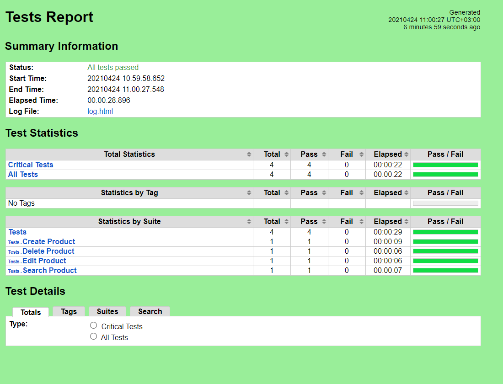

# Robot Framework Test Cases for
https://github.com/paulund/vuejs-crud.git

# Prerequisities
1. Robot Framework and chromedriver
2. Node.js & npm

# How to run
1. Clone repo
```
git clone https://github.com/paulund/vuejs-crud.git
```

2. Install server
```
cd vuejs-crud

npm install
```
**starting front-end**
```
npm run dev
```
**starting back-end**
```
node server.js
```

3. Run tests
```
cd ..\tests

robot .
```

4. Observe results
report.html

# Functionality and test cases
1. Create a product
    - user can add a new product and give a price
    - when the product is added, it is visible in 'All Products' page
    - price must be a number or else 'Price must be a number'
2. Edit a product
    - user can update product name and price
    - price must be a number or else 'Price must be a number'
3. Delete a product
    - user can delete products by clicking delete, which takes the user to a new page
    - user has to confirm deletion by click 'delete product'
4. Search a product
    - user can search by name of product (case insensitive)
5. User can view all products


# Example results
